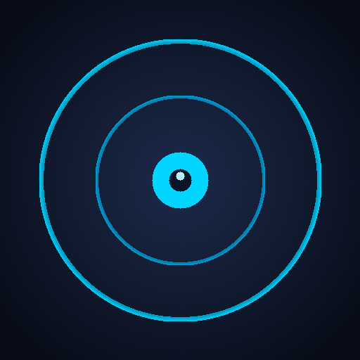
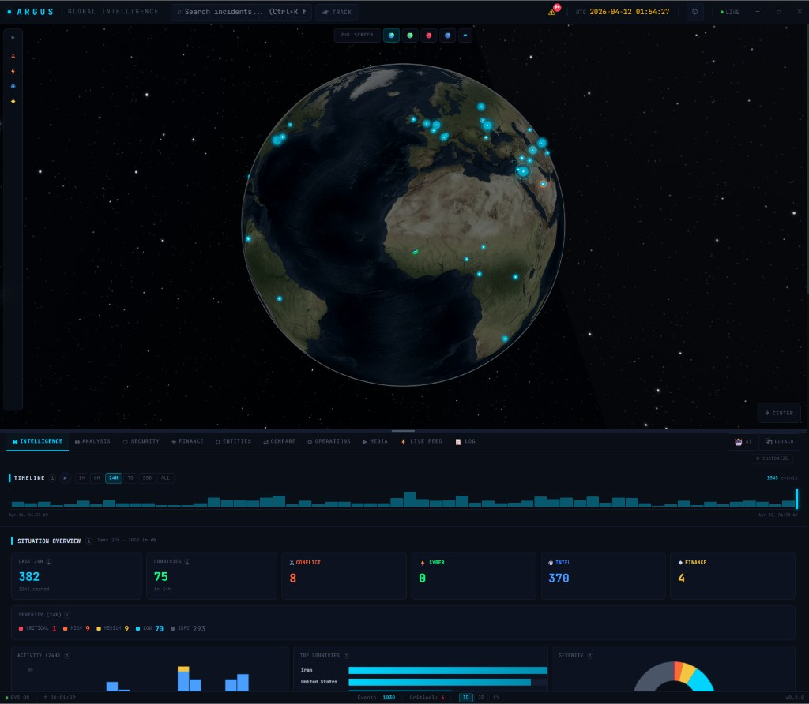
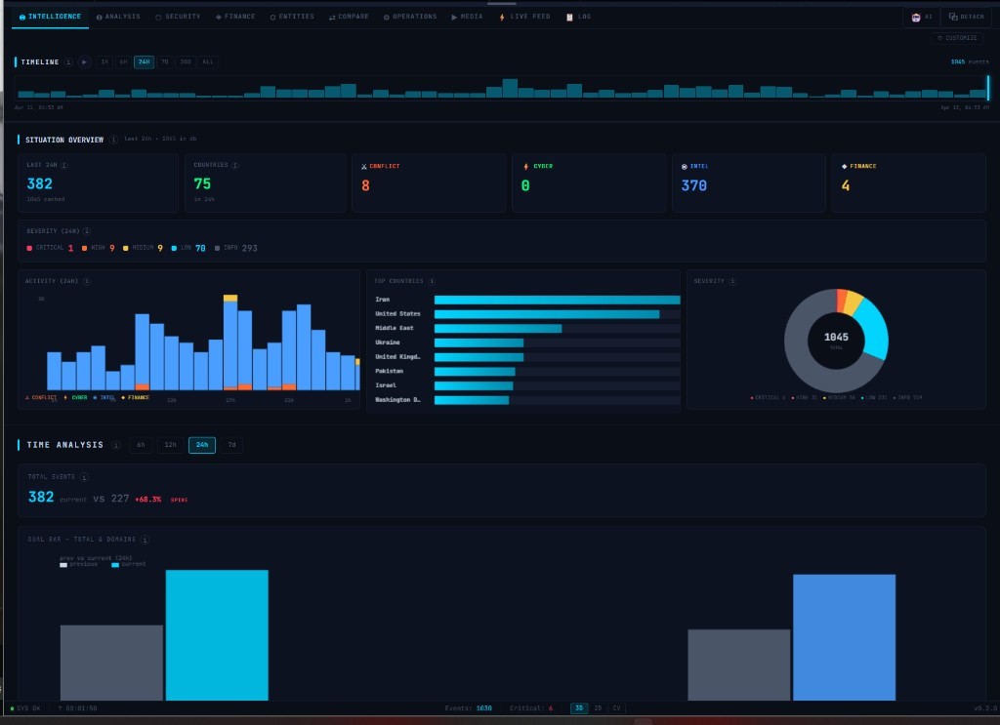
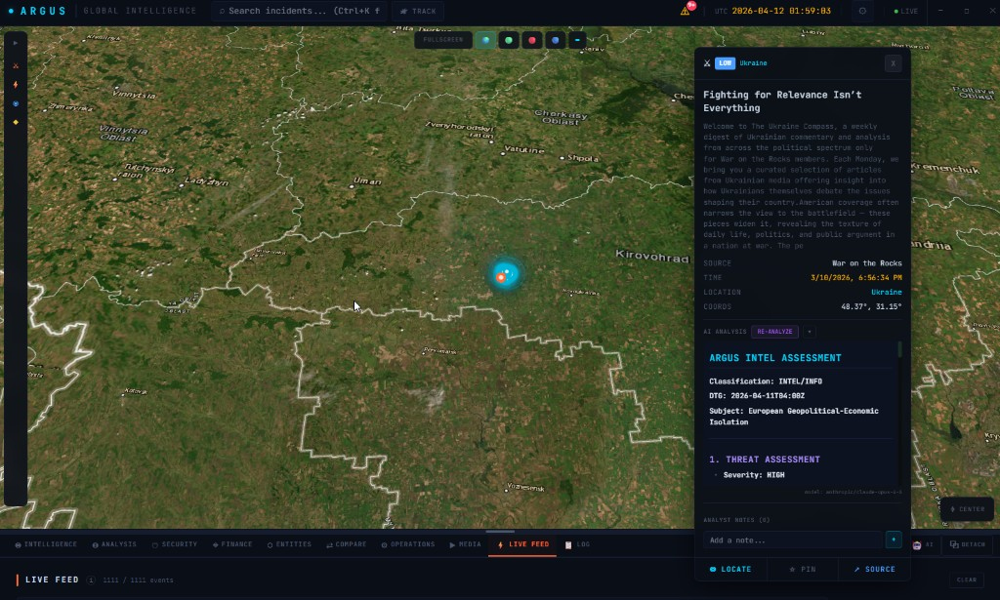
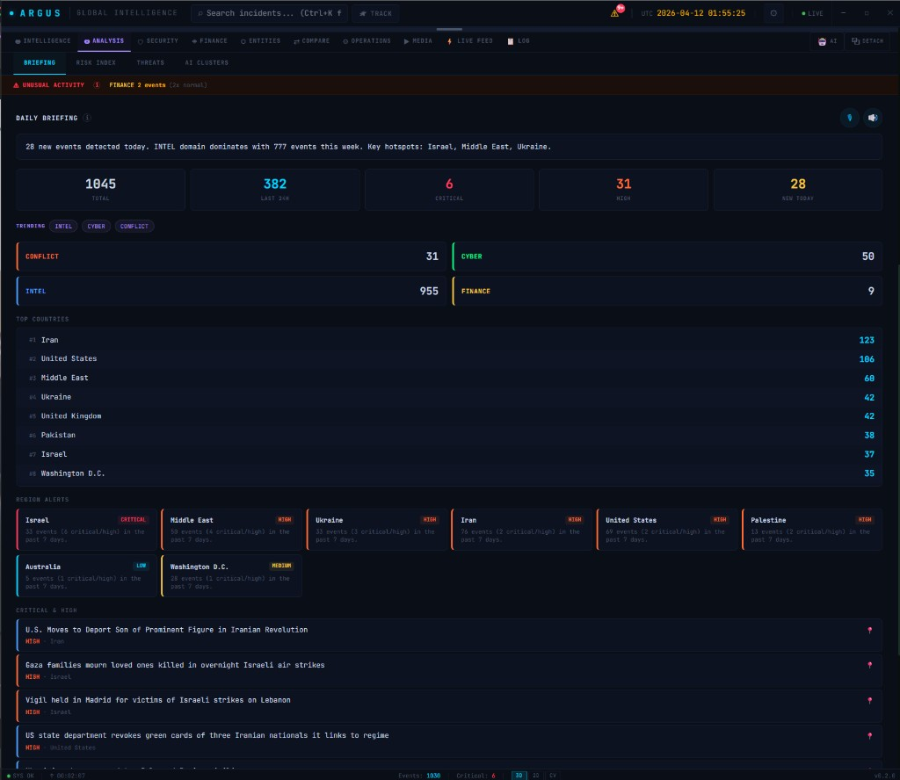
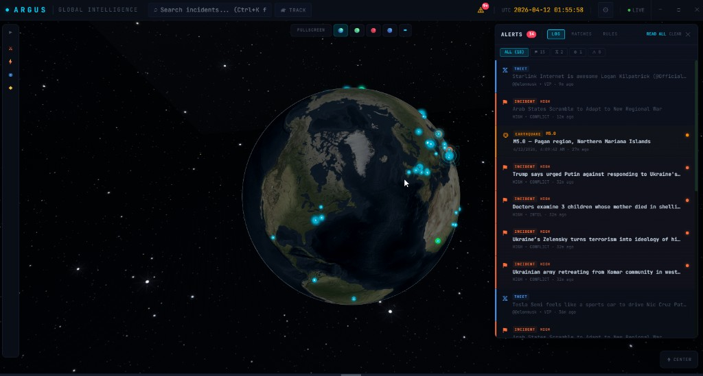
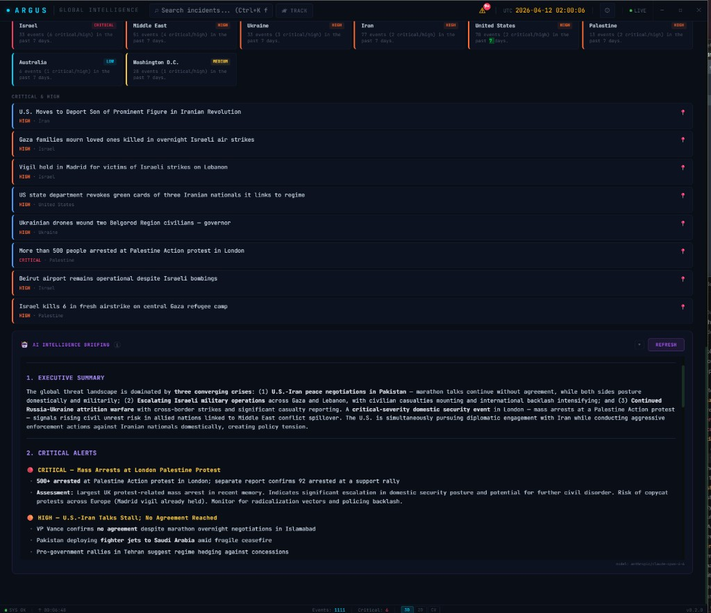
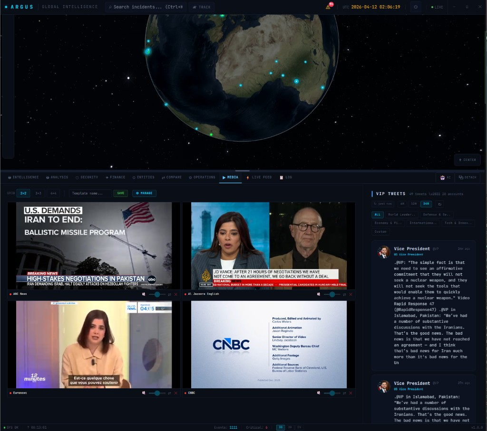
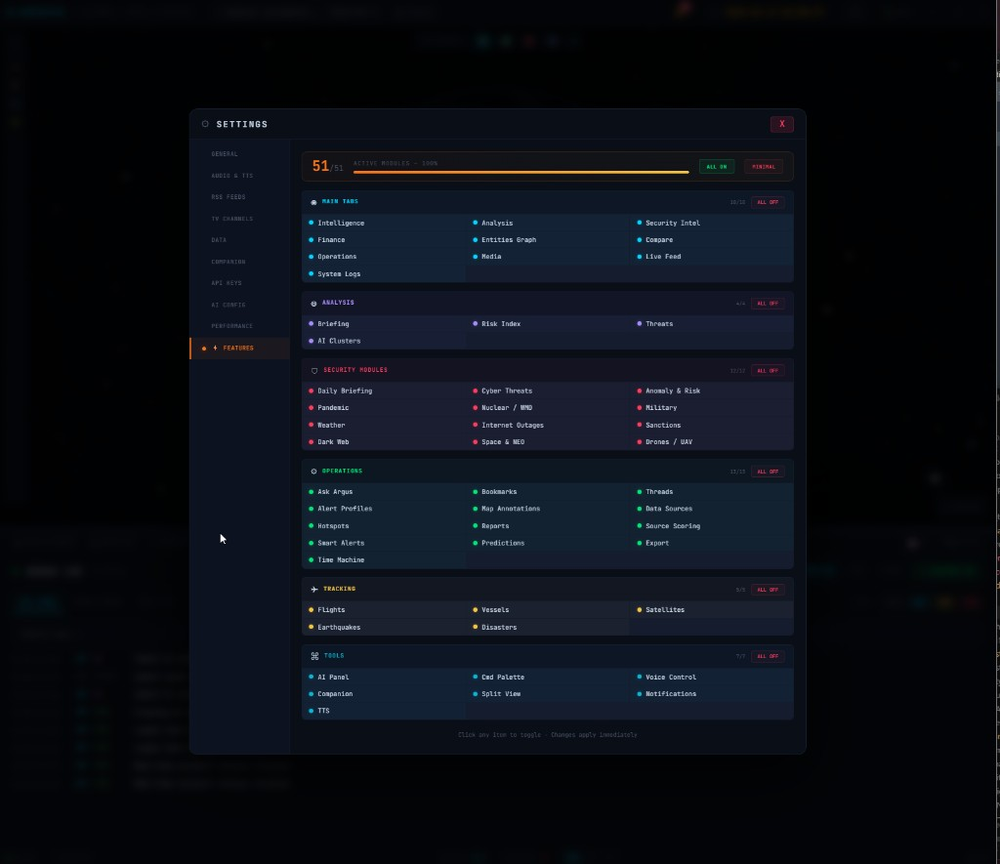

<p align="center">
  
</p>

<h1 align="center">ARGUS</h1>

<p align="center">
  <strong>Real-time Global OSINT & Intelligence Dashboard</strong>
</p>

<p align="center">
  <a href="#features">Features</a> •
  <a href="#installation">Installation</a> •
  <a href="#development">Development</a> •
  <a href="#architecture">Architecture</a> •
  <a href="#contributing">Contributing</a> •
  <a href="#license">License</a>
</p>

<p align="center">
  
  
  
  
</p>

---

## About

ARGUS is a desktop intelligence platform that aggregates, classifies, and visualizes global incidents in real time on an interactive 3D globe. It pulls data from dozens of open-source feeds (RSS, APIs, scrapers) and presents a unified operational picture for security analysts, researchers, and OSINT practitioners.

This is a **hobby/passion project** built to explore and push the boundaries of what's possible with **Electron, React, and CesiumJS**. The goal was to learn modern desktop app development end-to-end — from multi-process IPC architecture and SQLite-backed offline caching to real-time 3D globe rendering and AI-powered analysis pipelines. It's not a commercial product; it's a playground for experimentation, learning, and building something genuinely useful for the OSINT community.

Named after the hundred-eyed giant of Greek mythology — _Argus Panoptes_, the all-seeing guardian.

## Screenshots

<p align="center">
  
  <br/><em>3D Globe — Real-time incident visualization with multi-layer overlays</em>
</p>

<details>
<summary><strong>📸 More Screenshots</strong></summary>
<br/>

| Dashboard Widgets | Incident Details |
|:-:|:-:|
|  |  |
| *Threat score, timeline analysis, entity tracking* | *Detailed incident view with geolocation & entities* |

| Analysis & Operations | Alerts System |
|:-:|:-:|
|  |  |
| *Advanced search, bookmarks, and threat analysis* | *Smart alert rules with geofence & keyword triggers* |

| AI Summary | Media & Live TV |
|:-:|:-:|
|  |  |
| *AI-powered daily briefings and incident summaries* | *Multi-channel live TV grid with volume controls* |

| Settings |
|:-:|
|  |
| *Feeds, API keys, layers, alerts, and appearance configuration* |

</details>

## Features

### Core Intelligence
- **3D Globe Visualization** — CesiumJS-powered interactive globe with real-time incident markers, heatmaps, and animated arcs
- **Multi-Domain Feeds** — Aggregates CONFLICT, CYBER, INTEL, and FINANCE incidents from 50+ open-source feeds
- **AI-Powered Analysis** — Summarization, entity extraction, and daily briefings via Ollama, OpenAI, or custom endpoints
- **Smart Alert System** — Rule-based alerts with deduplication, geofence triggers, and desktop notifications

### Tracking & Monitoring
- **Flight Tracking** — Real-time aircraft positions via OpenSky Network with military aircraft filtering
- **Vessel Tracking** — Maritime vessel positions with route visualization
- **Satellite Tracking** — Active satellite positions via CelesTrak TLE data
- **Earthquake Monitoring** — USGS real-time earthquake data with magnitude filtering
- **Natural Disaster Alerts** — GDACS integration for floods, storms, and volcanic activity

### Security Intelligence
- **Cyber Threat Feeds** — Real-time CVEs, ransomware tracking, APT group monitoring
- **Dark Web Monitoring** — Alert aggregation from dark web sources
- **IoC Extraction** — Automatic extraction of IPs, domains, hashes, and URLs from text
- **SIGINT/RF Events** — Signal intelligence and radio frequency event monitoring
- **Sanctions Screening** — Real-time sanctions list checking

### Analysis Tools
- **Operations Console** — Advanced search, bookmarks, threads, and annotation management
- **Anomaly Detection** — Statistical anomaly detection with cascade alert system
- **Predictive Risk Scoring** — ML-based risk predictions by region and domain
- **Entity Relationship Graphs** — Interactive force-directed entity network visualization
- **Finance Dashboard** — Forex, crypto, commodities, and stock market tracking

### Platform Features
- **Offline-First Architecture** — SQLite-backed local cache, works without internet
- **Multi-Window Support** — Detach panels to secondary monitors
- **Companion Server** — WebSocket server for mobile companion app
- **Multi-Language** — English and Turkish UI (extensible)
- **Configurable Layers** — Toggle 20+ data overlay layers independently
- **TTS Alerts** — Text-to-speech for critical notifications

## Installation

### Download Pre-built Binaries

Download the latest release for your platform from the [Releases](https://github.com/0xhav0c/ARGUS/releases) page:

| Platform | Format |
|----------|--------|
| Windows  | `.exe` (NSIS installer) |
| macOS    | `.dmg` |
| Linux    | `.AppImage` |

### Build from Source

#### Prerequisites

- [Node.js](https://nodejs.org/) >= 18.x
- [Git](https://git-scm.com/)
- Python 3.x (for native module compilation)
- C++ build tools (for `better-sqlite3`)
  - **Windows**: `npm install -g windows-build-tools` or Visual Studio Build Tools
  - **macOS**: `xcode-select --install`
  - **Linux**: `sudo apt install build-essential python3`

#### Steps

```bash
# Clone the repository
git clone https://github.com/0xhav0c/ARGUS.git
cd ARGUS

# Install dependencies
npm install

# Copy Cesium static assets
npm run setup-cesium

# Start in development mode
npm run dev

# Build for production
npm run build

# Package for distribution
npm run dist
```

## Development

```bash
npm run dev          # Start with hot-reload
npm run build        # Production build
npm run lint         # Run ESLint
npm run lint:fix     # Fix linting issues
npm run typecheck    # TypeScript type checking
npm run test         # Run tests
npm run test:watch   # Run tests in watch mode
```

### Project Structure

```
src/
├── main/                   # Electron main process
│   ├── index.ts            # App entry, IPC handlers, service init
│   ├── database/           # SQLite schema & cache manager
│   ├── ipc/                # IPC handler modules
│   └── services/           # Backend services
│       ├── feed-aggregator.ts      # RSS/API feed aggregation
│       ├── tracking-service.ts     # Flight, vessel, earthquake tracking
│       ├── ai-service.ts           # AI provider abstraction
│       ├── cyber-threat-service.ts # CVE, ransomware feeds
│       ├── anomaly-engine.ts       # Statistical anomaly detection
│       └── ...                     # 20+ specialized services
├── preload/                # Electron preload (context bridge)
├── renderer/               # React frontend
│   ├── components/
│   │   ├── layout/         # AppShell, TopBar, StatusBar
│   │   ├── globe/          # CesiumGlobe, overlays, tracking layers
│   │   ├── pages/          # Operations, SecurityIntel, Media, Log
│   │   ├── panels/         # IncidentDetail, Finance, EntityGraph
│   │   └── dashboard/      # Dashboard widgets & settings
│   ├── hooks/              # React hooks (useIncidents, useGlobeCamera)
│   ├── stores/             # Zustand state management (15+ stores)
│   ├── i18n/               # Internationalization (en, tr)
│   └── data/               # Static data (countries, TV channels)
└── shared/                 # Shared types between main & renderer
```

## Architecture

```
┌──────────────────────────────────────────────────┐
│                  Electron Main                    │
│  ┌────────────┐  ┌────────────┐  ┌────────────┐ │
│  │   Feed     │  │  Tracking  │  │    AI      │ │
│  │ Aggregator │  │  Services  │  │  Service   │ │
│  └─────┬──────┘  └─────┬──────┘  └─────┬──────┘ │
│        │               │               │         │
│  ┌─────┴───────────────┴───────────────┴──────┐  │
│  │              IPC Bridge                     │  │
│  └─────────────────┬───────────────────────────┘  │
└────────────────────┼──────────────────────────────┘
                     │
┌────────────────────┼──────────────────────────────┐
│  Electron Renderer │                              │
│  ┌─────────────────┴───────────────────────────┐  │
│  │            Zustand Stores                    │  │
│  │  incidents │ filters │ layers │ alerts │ ... │  │
│  └──────┬─────────┬──────────┬────────┬────────┘  │
│         │         │          │        │           │
│  ┌──────┴─────────┴──────────┴────────┴────────┐  │
│  │           React Components                   │  │
│  │  Globe │ Dashboard │ Panels │ Operations     │  │
│  └──────────────────────────────────────────────┘  │
└───────────────────────────────────────────────────┘
```

### Tech Stack

| Layer | Technology |
|-------|-----------|
| Framework | Electron 41 |
| Frontend | React 19, TypeScript 6 |
| State | Zustand 5 |
| 3D Globe | CesiumJS |
| Database | SQLite (better-sqlite3) |
| Build | electron-vite, Vite 7 |
| Styling | Tailwind CSS 4 + inline styles |
| i18n | i18next |
| Testing | Vitest |

### API Keys (Optional)

ARGUS works without any API keys using public feeds. For enhanced data, configure keys in **Settings > API Keys**:

| Service | Purpose |
|---------|---------|
| OpenSky Network | Authenticated flight tracking (higher rate limits) |
| Shodan | Internet device search |
| AbuseIPDB | IP reputation checking |
| VirusTotal | Malware/URL scanning |
| OpenAI | AI-powered analysis (alternative to Ollama) |

## Contributing

Please read [CONTRIBUTING.md](CONTRIBUTING.md) for guidelines on how to contribute.

## License

This project is licensed under the **GNU Affero General Public License v3.0** — see the [LICENSE](LICENSE) file for details.

## Disclaimer

ARGUS is an OSINT tool designed for legitimate security research and situational awareness. All data is sourced from publicly available feeds and APIs. Users are responsible for complying with applicable laws and the terms of service of upstream data providers.

---

<p align="center">
  <code>electron</code> · <code>react</code> · <code>typescript</code> · <code>cesiumjs</code> · <code>osint</code> · <code>cybersecurity</code> · <code>threat-intelligence</code> · <code>desktop-app</code> · <code>sqlite</code> · <code>zustand</code> · <code>vite</code> · <code>3d-globe</code> · <code>real-time</code> · <code>flight-tracking</code> · <code>geospatial</code>
</p>

<p align="center">
  <sub>Built with ⚡ by <a href="https://github.com/0xhav0c">0xhav0c</a></sub>
</p>
